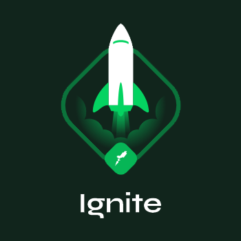

<div align="center">
  
</div>
<h1 align="center">Ignite Challenge 3: Create a shop cart hook</h1>
<h4 align="center">by <a href="https://www.rocketseat.com.br/" target="_blank">Rocketseat</a></h4>

## Apply the ReactJS Fundamentals

> In this challenge, we will create a shop cart React Hook as specified on this [link](https://www.notion.so/Desafio-01-Criando-um-hook-de-carrinho-de-compras-5769216778794019a83f544e79167b12#2b130166fcb444d5b3e9155d7700d560).

## Develop, Build and Test

* Development mode:
```bash
yarn dev
```

* Build:
```bash
yarn build
```

* Test:
```
yarn test
yarn test src/__tests__/components/Header.spec.tsx
yarn test src/__tests__/hooks/useCart.spec.tsx
yarn test src/__tests__/pages/Cart.spec.tsx
yarn test src/__tests__/pages/Home.spec.tsx
```
